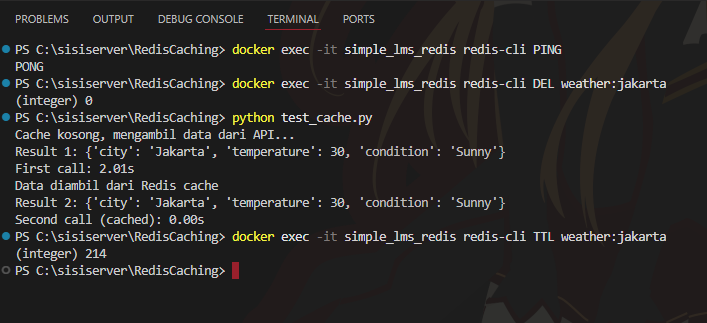
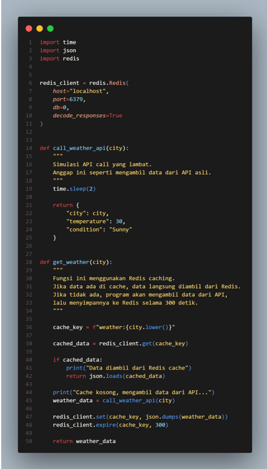

# Laporan Redis Caching Exercise

## 1. Pendahuluan

Tugas ini bertujuan untuk mengimplementasikan caching sederhana menggunakan Redis. Caching digunakan untuk menyimpan hasil pemanggilan API agar request berikutnya dapat mengambil data dari cache, bukan memanggil API kembali.

Pada program ini, fungsi `get_weather(city)` dimodifikasi agar dapat menyimpan hasil API call ke Redis selama 5 menit atau 300 detik. Dengan begitu, pemanggilan pertama akan berjalan lebih lambat karena mengambil data dari API, sedangkan pemanggilan kedua akan berjalan lebih cepat karena data sudah tersedia di Redis cache.

---

## 2. Struktur File Project

Struktur project yang digunakan adalah sebagai berikut:

```text
RedisCaching/
│
├── weather_api.py
├── test_cache.py
├── requirements.txt
├── cache_report.md
└── screenshots/
    ├── weather-api-code.png
    └── cache-test-result.png
```

Keterangan file:

- `weather_api.py`: berisi fungsi API simulasi dan logic Redis caching.
- `test_cache.py`: berisi script untuk menguji perbedaan waktu antara pemanggilan pertama dan kedua.
- `requirements.txt`: berisi dependency Python yang digunakan.
- `cache_report.md`: dokumentasi hasil pengerjaan tugas.
- `screenshots/`: folder untuk menyimpan screenshot hasil testing dan kode.

---

## 3. Instalasi dan Verifikasi Redis

Redis dijalankan menggunakan Docker. Pada komputer saya, Redis sudah berjalan di container bernama `simple_lms_redis` dan menggunakan port `6379`.

Untuk memastikan Redis berjalan, saya menggunakan command berikut:

```powershell
docker exec -it simple_lms_redis redis-cli PING
```

Hasil yang diperoleh:

```text
PONG
```

Hasil `PONG` menunjukkan bahwa Redis sudah aktif dan dapat menerima command.

Screenshot verifikasi Redis, hasil testing, dan TTL dapat dilihat pada gambar berikut:



---

## 4. Kode yang Dimodifikasi

Pada file `weather_api.py`, fungsi `get_weather(city)` dimodifikasi agar menggunakan Redis cache.

Screenshot kode `weather_api.py`:



Kode utama yang digunakan adalah sebagai berikut:

```python
import time
import json
import redis


redis_client = redis.Redis(
    host="localhost",
    port=6379,
    db=0,
    decode_responses=True
)


def call_weather_api(city):
    """
    Simulasi API call yang lambat.
    Anggap ini seperti mengambil data dari API asli.
    """
    time.sleep(2)

    return {
        "city": city,
        "temperature": 30,
        "condition": "Sunny"
    }


def get_weather(city):
    """
    Fungsi ini menggunakan Redis caching.
    Jika data ada di cache, data langsung diambil dari Redis.
    Jika tidak ada, program akan mengambil data dari API,
    lalu menyimpannya ke Redis selama 300 detik.
    """

    cache_key = f"weather:{city.lower()}"

    cached_data = redis_client.get(cache_key)

    if cached_data:
        print("Data diambil dari Redis cache")
        return json.loads(cached_data)

    print("Cache kosong, mengambil data dari API...")
    weather_data = call_weather_api(city)

    redis_client.set(cache_key, json.dumps(weather_data))
    redis_client.expire(cache_key, 300)

    return weather_data
```

---

## 5. Penjelasan Cara Kerja Caching

Alur kerja program adalah sebagai berikut:

1. User memanggil fungsi `get_weather("Jakarta")`.
2. Program membuat cache key dengan nama `weather:jakarta`.
3. Program mengecek Redis menggunakan command `GET`.
4. Jika data ditemukan di Redis, program langsung mengembalikan data dari cache.
5. Jika data tidak ditemukan, program memanggil API simulasi yang membutuhkan waktu sekitar 2 detik.
6. Hasil API disimpan ke Redis menggunakan command `SET`.
7. Cache diberi waktu kedaluwarsa 300 detik menggunakan command `EXPIRE`.
8. Pada pemanggilan berikutnya, data diambil dari Redis sehingga response time menjadi jauh lebih cepat.

---

## 6. Redis Command yang Digunakan

### 6.1 GET

Command `GET` digunakan untuk mengambil data dari Redis cache.

```python
cached_data = redis_client.get(cache_key)
```

Jika data tersedia, maka program akan langsung mengembalikan data tersebut tanpa memanggil API.

---

### 6.2 SET

Command `SET` digunakan untuk menyimpan hasil API call ke Redis.

```python
redis_client.set(cache_key, json.dumps(weather_data))
```

Karena data berbentuk dictionary Python, data diubah terlebih dahulu menjadi format JSON string menggunakan `json.dumps()` sebelum disimpan ke Redis.

---

### 6.3 EXPIRE

Command `EXPIRE` digunakan untuk mengatur masa berlaku cache.

```python
redis_client.expire(cache_key, 300)
```

Pada tugas ini, cache disimpan selama 300 detik atau 5 menit. Setelah waktu tersebut habis, Redis akan menghapus cache secara otomatis.

---

## 7. Testing Program

Testing dilakukan menggunakan file `test_cache.py`. Script ini memanggil fungsi `get_weather("Jakarta")` sebanyak dua kali.

Pemanggilan pertama seharusnya lambat karena data belum tersedia di cache. Pemanggilan kedua seharusnya cepat karena data sudah tersimpan di Redis cache.

Command yang digunakan untuk menjalankan testing:

```powershell
python test_cache.py
```

Sebelum menjalankan test, cache lama dihapus terlebih dahulu menggunakan command:

```powershell
docker exec -it simple_lms_redis redis-cli DEL weather:jakarta
```

Hal ini dilakukan agar pemanggilan pertama benar-benar mengambil data dari API simulasi, bukan dari cache lama.

---

## 8. Hasil Testing

Hasil testing yang diperoleh:

```text
Cache kosong, mengambil data dari API...
Result 1: {'city': 'Jakarta', 'temperature': 30, 'condition': 'Sunny'}
First call: 2.01s

Data diambil dari Redis cache
Result 2: {'city': 'Jakarta', 'temperature': 30, 'condition': 'Sunny'}
Second call (cached): 0.00s
```

Dari hasil tersebut, terlihat bahwa:

- Pemanggilan pertama membutuhkan waktu sekitar 2.01 detik.
- Pemanggilan kedua membutuhkan waktu sekitar 0.00 detik.

Perbedaan ini menunjukkan bahwa Redis caching berhasil bekerja. Pemanggilan pertama mengambil data dari API simulasi, sedangkan pemanggilan kedua mengambil data dari Redis cache.

---

## 9. Verifikasi Expiry Cache

Untuk memastikan cache memiliki waktu kedaluwarsa, saya menggunakan command berikut:

```powershell
docker exec -it simple_lms_redis redis-cli TTL weather:jakarta
```

Hasil yang diperoleh:

```text
(integer) 214
```

Angka `214` menunjukkan bahwa cache `weather:jakarta` masih memiliki sisa waktu 214 detik sebelum expired. Nilai ini normal karena cache awalnya diset selama 300 detik, lalu terus berkurang seiring waktu.

Dengan demikian, command `EXPIRE` berhasil diterapkan.

---

## 10. Jawaban Pertanyaan

### 10.1 Kenapa response time berbeda?

Response time berbeda karena pada pemanggilan pertama, data belum tersedia di Redis cache. Oleh karena itu, program harus memanggil API simulasi yang dibuat lambat menggunakan `time.sleep(2)`. Proses ini menyebabkan pemanggilan pertama membutuhkan waktu sekitar 2 detik.

Pada pemanggilan kedua, data sudah tersimpan di Redis. Program tidak perlu memanggil API lagi, tetapi langsung mengambil data dari cache menggunakan command `GET`. Karena Redis menyimpan data di memory, proses pengambilan data menjadi sangat cepat.

---

### 10.2 Apa keuntungan caching?

Keuntungan caching adalah:

1. Mengurangi response time aplikasi.
2. Mengurangi jumlah request ke API atau server utama.
3. Menghemat resource server.
4. Membuat aplikasi terasa lebih cepat bagi user.
5. Cocok digunakan untuk data yang sering diminta dan tidak berubah terlalu cepat.

---

### 10.3 Kapan sebaiknya tidak menggunakan cache?

Caching sebaiknya tidak digunakan untuk data yang harus selalu real-time atau sangat sensitif terhadap perubahan. Contohnya:

1. Saldo rekening atau e-wallet.
2. Status pembayaran terbaru.
3. Stok barang yang harus selalu akurat.
4. Data keamanan atau autentikasi.
5. Data yang berubah sangat cepat setiap detik.

Jika caching digunakan pada data seperti ini, user bisa menerima informasi yang sudah tidak akurat.

---

## 11. Kesimpulan

Implementasi Redis caching pada fungsi `get_weather(city)` berhasil dilakukan. Program dapat mengecek cache menggunakan `GET`, menyimpan data menggunakan `SET`, dan mengatur masa berlaku cache menggunakan `EXPIRE` selama 300 detik.

Hasil testing menunjukkan bahwa pemanggilan pertama membutuhkan waktu sekitar 2.01 detik, sedangkan pemanggilan kedua hanya membutuhkan waktu sekitar 0.00 detik. Hal ini membuktikan bahwa Redis caching dapat meningkatkan performa aplikasi dengan mengurangi waktu response pada request berikutnya.
